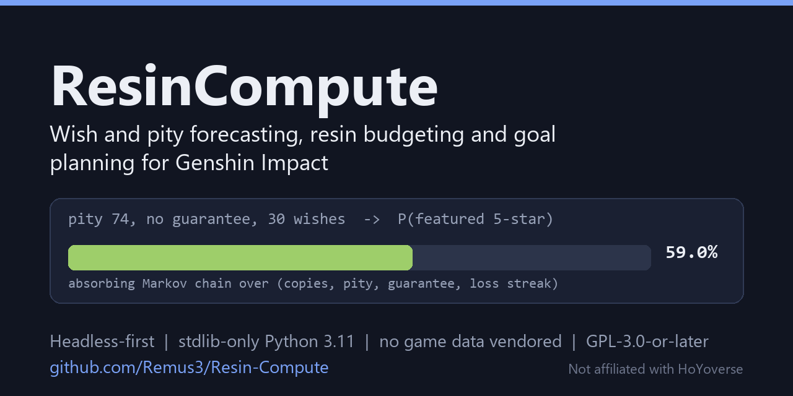

<p align="center">
  
</p>

# ResinCompute

**Gacha arithmetic for Genshin Impact - wish and pity forecasting, resin
budgeting and goal planning, off your own public Enka profile. Headless-first,
stdlib-only Python, no game data vendored.**

[](https://github.com/Remus3/Resin-Compute/actions/workflows/ci.yml)
[](https://github.com/Remus3/Resin-Compute/actions/workflows/docs-guards.yml)
[](https://www.python.org/downloads/)
[](requirements.txt)
[](LICENSE)

[What it is](#what-it-is) - [Status](#status) - [Quickstart](#quickstart) -
[Example](#example-output) - [How it works](#how-it-works) -
[How it is built](#how-it-is-built) - [Docs](#documentation) -
[Licence](#licence)

**Not affiliated with, endorsed by, or connected to HoYoverse / miHoYo /
Cognosphere.** "Genshin Impact" and all associated names and material are their
property. This is an independent, non-commercial companion tool that vendors
none of their data.

## What it is

ResinCompute turns the parts of Genshin Impact that are arithmetic rather than
opinion into answers you can check. Its core is **PityEngine**
(`agents/pity_engine/`, HTTP `:8790`), a pure, deterministic gacha forecaster
with its own test suite. Roster data comes from a player's own public
Enka.Network showcase, through a client re-implemented from the published
protocol. It is a developer tool: no installer, no hosted page; everything runs
from a CLI or a background daemon, and the dashboard is optional.

Questions it is built to answer:

- I am 74 pulls in with no guarantee. What are my odds of landing the featured
  5-star inside my next 30 wishes? **Answered today.**
- I want two constellations and the signature weapon. How many wishes should I
  expect to spend, and how much does a guarantee change that? **Answered today.**
- I want this character at 90 with 9/9/9 talents. What does that cost in resin,
  and in what order? **Not yet** - `data/costs/` holds zero material rows, so
  the goal DAG and scheduler emit correct shapes with empty costs.

## Status

As of 2026-10-03. [`ROADMAP.md`](ROADMAP.md) is the live source; the full
table is in [`docs/OVERVIEW.md`](docs/OVERVIEW.md#status-in-full).

| | Area |
|---|---|
| **Shipped** | Wish forecaster (character, weapon, standard, Chronicled banners) - PityEngine HTTP service - headless lane with six jobs, daemon and supervisor - Enka ingest - state persistence - goal DAG with cycle detection and critical path - row-scoped provenance schema - cross-repo responder |
| **Partial** | Dashboard (six panels; a fresh clone renders 2 READY, 4 NOT_WIRED) - material costs (zero rows) - scheduler (day offsets, no calendar dates) - resin panel (hand-typed observation) - constellation talent mapping |
| **Planned** | Artifact scoring - banner calendar ("by when", not just "given N pulls") - income velocity - team solver |

## Quickstart

Python 3.11 or newer. The runtime is stdlib only; only the dev toolchain needs
installing. Commands are PowerShell (the project is developed on Windows); a
POSIX equivalent of the forecast call is in
[`docs/OPERATIONS.md`](docs/OPERATIONS.md#the-engine-the-lane-the-supervisor-and-the-dashboard).

```powershell
git clone https://github.com/Remus3/Resin-Compute.git
cd Resin-Compute
python scripts/install_hooks.py          # FIRST: a fresh clone runs no hooks
python -m pip install -r requirements-dev.txt

python -m pytest tests                   # application suite
python -m pytest agents/pity_engine      # engine suite - run the two separately
```

Start the engine, then ask it the first question above from a second console:

```powershell
python -m agents.pity_engine --port 8790

$body = @{ banner = 'character_event'; pity_5star = 74; has_guarantee = $false
           consecutive_5050_losses = 0; target_count = 1; pull_budget = 30 } |
        ConvertTo-Json
Invoke-RestMethod -Method Post -Uri http://127.0.0.1:8790/forecast `
  -ContentType 'application/json' -Body $body
```

The engine (8790) and the dashboard (8791, `python -m surface`) bind to
`127.0.0.1` and **do not authenticate** - do not expose them to a network you do
not control. Any path works for the checkout, spaces included: the canonical
one here is `E:\Resin Compute`. Bootstrap, the headless lane, the supervisor
and everything else: [`docs/OPERATIONS.md`](docs/OPERATIONS.md).

## Example output

The response to that request, reproduced from the engine on 2026-10-03:

```json
{
  "status": "ok",
  "engine_version": "0.1.0",
  "probability": 0.5904331542650183,
  "pull_budget": 30,
  "target_count": 1,
  "banner": "character_event",
  "distribution": [
    0.40956684573498164,
    0.5904331542650183
  ],
  "expected_pulls": 33.82161353538069
}
```

A 59.0% chance of at least one copy inside 30 pulls, 41.0% of none, and about 34
pulls expected to the first copy from this state. `distribution[k]` is the
probability of exactly `k` copies.

## How it works

- **Forecaster.** An absorbing Markov chain over
  `(copies, pity, guarantee, loss_streak)`, never a binomial on 1.600% (that is
  a long-run average, not a per-wish probability). Three easy-to-get-wrong
  constants are regression-tested: the 55.000% consolidated 50/50 since version
  5.0, the weapon soft-pity ramp saturating at pull 77, and the pull budget a
  probability needs. Detail:
  [`docs/OVERVIEW.md`](docs/OVERVIEW.md#what-the-forecaster-models).
- **Ingest.** `ingest/enka_client.py` sends a required custom User-Agent,
  honours `ttl` on every response and refuses UID enumeration.
- **Headless lane.** `headless/runner.py` runs six registered jobs
  (`sync_profile`, `reconcile_state`, `persist_state`, `recompute_plan`,
  `forecast_pity`, `emit_health`) once, as a daemon, or under
  `ops/supervisor.py`, which restarts it and writes a health file. Each live
  pass holds a slot from a vendored machine-wide concurrency governor
  (`ops/loop/`), so parallel background lanes on one machine queue rather than
  collide.
- **Planning.** `engines/` holds the goal DAG, a resin-, rotation- and weekly
  lockout-aware scheduler and a recommendation solver - mechanism only, waiting
  on first-hand cost rows.
- **Surfaces.** A local dashboard (`surface/`) whose panels declare READY,
  PARTIAL or NOT_WIRED instead of showing placeholder numbers, and an optional
  Electron tray companion (`shell/`, ADR-005).
- **Data.** None vendored. `data/fixtures/` is hand-authored; every future row
  in `data/` must carry a provenance receipt (`docs/PROVENANCE_SCHEMA.md`).
  Posture and refused sources: [`docs/LICENSE_NOTES.md`](docs/LICENSE_NOTES.md).

### Things that act outside the checkout

None of these run unless you invoke them, and none is needed by the Quickstart.
Removal commands are in
[`docs/OPERATIONS.md`](docs/OPERATIONS.md#the-windows-scheduled-tasks-and-how-to-remove-them).

- `ops/install_scheduled_task.ps1` registers a **hidden** logon task at the
  highest available privilege with no time limit; it outlives the clone.
- `ops/install_responder_task.ps1` registers a **hidden** five-minute responder
  task for an agreed window; its definition also outlives the clone.
- `tools/screen_capture.py` (with `tools/first_run_capture.py` and
  `tools/capture_supervisor.py`) writes **full-screen** screenshots to disk.
- `scripts/make_shortcut.py` writes a Desktop shortcut outside the repository.
- `tools/wish_authkey.py` handles a short-lived Wish History credential; see
  [`SECURITY.md`](SECURITY.md).

## How it is built

ResinCompute is developed with Claude Code agents, under rules
that live in the repository and are enforced by tests and hooks rather than by
good intentions.

- **Multi-agent sessions by default** (ADR-007). A session plans, then
  dispatches disjoint slices to a roster in `.claude/agents/` - planner,
  builder, adversary, adjudicator, verifier, researcher, ui-auditor. The agent
  that produced a change never grades it: an adversary tries to refute it, and
  a separate adjudicator decides. Refutations and their fixes are recorded in
  [`docs/LEDGER.md`](docs/LEDGER.md).
- **Gates that a fresh clone installs.** Three git hooks (banned glyphs,
  net-new lint, commit message shape, both suites before a push) plus CI on
  Python 3.11. Guards check the docs too: every path a governing doc cites must
  exist and be tracked by git.
- **Cross-repo note sync, end to end.** This tree is one of several sibling
  repositories that coordinate through plain-file notes (conventions in
  [`docs/CHANNEL.md`](docs/CHANNEL.md)). `scripts/watch_inbox.py` reports new
  notes at session start, and `tools/moon_sync_responder.py` answers them with
  nobody present: a scheduled task fires it every five minutes, it runs a
  headless agent that may only write a draft inside this repository, then
  validates the draft itself (ASCII, LF, no account paths, no tracebacks) and delivers
  it only to the sender. Notes from the supervising repository are checked by
  SHA-256 against the sender's outbox copy (ADR-011), and delivery counts only
  once the recipient's copy hashes equal.
- **Headless background lanes.** Every unattended agent run goes through one
  vendored spawn helper (`ops/fleet_kit/`, byte-pinned by
  `tests/test_fleet_kit.py`) that fails closed, shows no console window, caps
  runs at 120 per rolling 24 hours and publishes a live status file. The
  application's own lane runs the same way under the supervisor, slotted by the
  concurrency governor.

## Documentation

| Read | For |
|---|---|
| [`docs/OVERVIEW.md`](docs/OVERVIEW.md) | Full status, direction, the forecaster's model, data posture, why Python |
| [`docs/OPERATIONS.md`](docs/OPERATIONS.md) | Running everything, scheduled tasks and removal, ports, conventions |
| [`docs/SPEC_SCAFFOLD.md`](docs/SPEC_SCAFFOLD.md) | The build contract and the verified gacha constants |
| [`docs/adr/README.md`](docs/adr/README.md) | Architectural decisions, indexed |
| [`ROADMAP.md`](ROADMAP.md) / [`docs/LEDGER.md`](docs/LEDGER.md) | Open work / closed work, newest first |
| [`docs/LICENSE_NOTES.md`](docs/LICENSE_NOTES.md) | What may and may not be consumed |
| [`CONTRIBUTING.md`](CONTRIBUTING.md) - [`SECURITY.md`](SECURITY.md) - [`CODE_OF_CONDUCT.md`](CODE_OF_CONDUCT.md) | Gates and the no-vendoring rule - private vulnerability reports - Contributor Covenant 2.1 |

## Repository tree

Guarded by `tests/test_readme_tree.py`: every path named here must exist on
disk and be stored by git.

<details>
<summary>Expand the tree</summary>

```
Resin-Compute/
  README.md                        this file
  CLAUDE.md                        agent context, hard rules, session workflow
  ROADMAP.md                       open work, newest priorities first
  CONTRIBUTING.md                  the gates, and what may not be vendored
  LICENSE                          GPL-3.0-or-later, verbatim and hash-pinned
  pytest.ini                       dual-suite config, never run pytest . at root
  .claude/                         the agent roster and the session commands
  .githooks/                       AUTHORITATIVE gate, inert until installed
    pre-commit                     banned glyphs, py_compile, net-new ruff
    commit-msg                     subject shape and the trailer policy
    pre-push                       runs BOTH suites before a push leaves
  .github/
    workflows/                     ci.yml, and docs-guards.yml for what it declines

  core/                            the shared contract and the primitives
    types.py                       every dataclass the other packages agree on
    atomic_io.py                   the ONLY sanctioned state-write path
    state_io.py                    AccountState snapshot serialization
    resin.py                       resin regeneration, caps, condensed, fragile
    domains.py                     weekday rotation and weekly boss resets
    ports.py                       the single owner of this project's port block
    provenance.py                  the row-scoped receipt every data/ value carries
  agents/
    pity_engine/                   PityEngine - pure deterministic forecaster
      banners.py                   hazard tables and soft-pity ramps, all four
      markov.py                    absorbing Markov chain DP
      forecast.py                  public API
      __main__.py                  stdlib HTTP service on 8790
      tests/                       the engine validates itself
  engines/                         planning and optimization, mechanism only
    objectives.py                  goal DAG, cycle detection, critical path
    scheduler.py                   resin, rotation and weekly lockout aware
    recommend.py                   what to get / who to build solver
  ingest/                          external data, re-implemented from protocol
    enka_client.py                 stdlib urllib, ttl-honouring, policy bound
    enka_mapper.py                 raw payload to EnkaMappedProfile
    static_data.py                 the ONLY place character and material ids live
  headless/                        THE headless lane
    runner.py                      non-interactive entrypoint, CLI and daemon
    jobs.py                        job registry, per-job isolation

  surface/                         the dashboard, served on 8791
    model.py                       pure model, decides panel readiness
    render.py                      HTML rendering
  shell/                           Electron companion with a tray, ADR-005
    main.js                        window, tray and supervisor lifecycle
    lib/                           endpoint, geometry, state, supervisor, tray
  ops/                             supervision and operational state
    supervisor.py                  watchdog, restart trigger, bounded backoff
    ResinCompute-Supervisor.xml    hidden ONLOGON task, elevated, no time limit
    install_scheduled_task.ps1     registers it - removal is documented above
    ResinCompute-Responder.xml     hidden windowed task, least privilege, PT30M
    install_responder_task.ps1     registers it - -Remove is its kill switch
    loop/                          sha256-pinned; two separately measured carrier populations, never edit alone
  scripts/
    install_hooks.py               FIRST thing to run in a fresh clone
    bootstrap_data.py              runnable data bootstrap
    make_shortcut.py               writes a Desktop shortcut OUTSIDE the checkout
  tools/
    precommit_gate.py              banned-glyph and net-new-ruff gate
    wish_authkey.py                Wish History capture, credential-aware
    screen_capture.py              screenshot cadence, writes FULL-SCREEN images
    first_run_capture.py           watches the one-time first-launch artefacts
    capture_supervisor.py          keeps the capture lane alive, reports to a file
  data/
    fixtures/                      hand-authored fixtures, nothing vendored
    costs/                         empty on purpose, first-hand tables only
  docs/
    OVERVIEW.md                    full status, the model, data posture
    OPERATIONS.md                  running, scheduled tasks, ports, conventions
    SPEC_SCAFFOLD.md               the build contract, verified constants
    LEDGER.md                      append-only completion history, newest first
    GOAL_SPEC_SEED_TEAM.md         the seed-team goal, every claim stamped
    LICENSE_NOTES.md               inbound posture, read before adding a source
    PROVENANCE_SCHEMA.md           the receipt every data/ value carries
    adr/                           architectural decisions, indexed
  tests/                           the application suite
    _parked/                       quarantined tests, deliberately not collected
```

</details>

`ops/loop/` is digest-pinned against copies in other repositories; why a single
count over that directory is the wrong summary is in
[`docs/OPERATIONS.md`](docs/OPERATIONS.md#on-opsloop-and-its-two-carrier-populations).

## Licence

**GPL-3.0-or-later.** See `LICENSE` for the full text and `NOTICE` for the
copyright line; ADR-006 records why. You may use, study, modify and redistribute
this, including commercially, but any derivative you distribute must carry the
same licence and its source must be available.

One vendored directory carries its own grant: `ops/fleet_kit/` is the
operator's FLEET-KIT under Apache-2.0, with its own `LICENSE` and `NOTICE`
retained unedited beside it. Apache-2.0 code may be combined into a
GPL-3.0-or-later work, so the combined work still ships under `LICENSE`.

That licence covers this project's own code only. It grants nothing over
Genshin Impact's data, names, statistics or assets, which belong to HoYoverse;
what this project may consume is a separate question, answered in
`docs/LICENSE_NOTES.md`.

<sub>Two workflow badges, because `ci` ignores Markdown-only pushes and
`docs-guards` covers exactly those.</sub>
